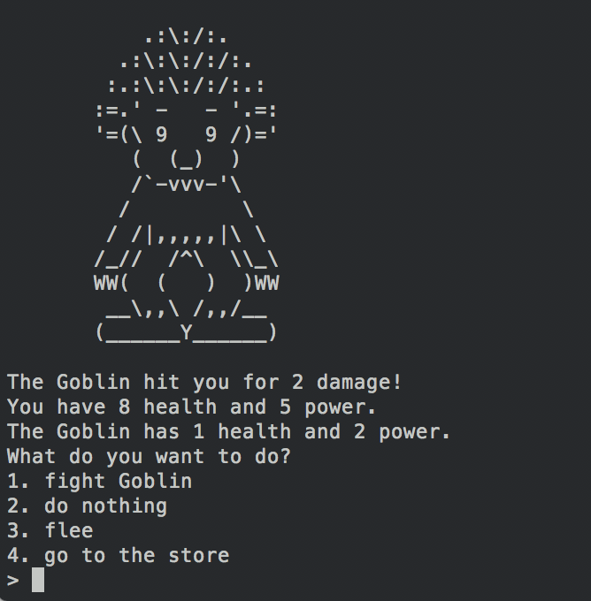
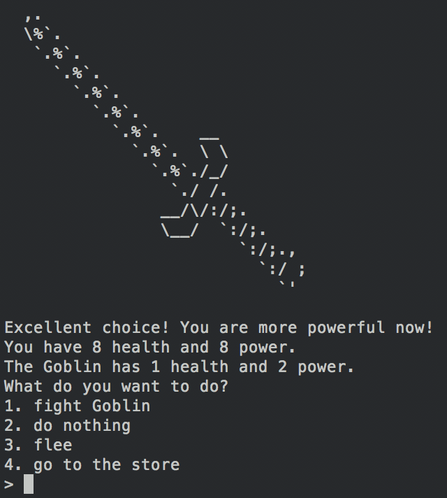
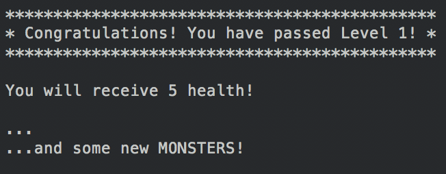

## Text-RPG (Role-playing game)
Vintage role-playing game in which the user fights various monsters and can purchase items at a store. There are three levels through which the user can travel, each with a unique mix of monsters.

## Github Link:
[RPG GitHub](https://github.com/eddieatkinson/text-rpg)

## Technologies used:
**Languages:**
* Python

## Code snippets:
Character class:
``` python
class Character(object):
    def __init__(self, name, health, power, loot, image):
        self.name = name
        self.health = health
        self.power = power
        self.loot = loot
        self.image = image
    def take_damage(self, amount_of_damage):
        rand_pwr_assign = randint(1, 10)
        if rand_pwr_assign > 8: # Attacks will be double power with 20% probability.
            print "You attacked! The %s has received %s damage." % (self.name, 2 * amount_of_damage)
            self.health -= 2 * amount_of_damage
        else:
            print "You attacked! The %s has received %s damage." % (self.name, amount_of_damage)
            self.health -= amount_of_damage
    def is_alive(self):
        return self.health > 0
    def print_image(self):
        print self.image
    def reduce_strength(self, power_decrease):
        self.power -= power_decrease
    def recuperate(self): # This is an empty method, made for Medic.
        pass
    def special_pwr(self): # This is an empty method, made for Wizard and Dragon.
        pass
```
Goblin subclass of Character:
``` python
class Goblin(Character):
    def __init__(self):
        super(Goblin, self).__init__('Goblin', 6, 2, 2, """
           .:\:/:.
         .:\:\:/:/:.
        :.:\:\:/:/:.:
       :=.' -   - '.=:
       '=(\ 9   9 /)='
          (  (_)  )
          /`-vvv-'\\
         /         \\
        / /|,,,,,|\ \\
       /_//  /^\  \\\_\\
       WW(  (   )  )WW
        __\,,\ /,,/__
       (______Y______)
            """)
```
Items class:
``` python
class Items(object):
    def __init__(self, name, price, image):
        self.name = name
        self.price = price
        self.image = image
    def print_image(self):
        print self.image
img{
    /*Keep the image inside the parent no matter what.*/
    max-width: 100%;
}
```
Potion subclass of Items:
``` python
class Potion(Items):
    def __init__(self):
        super(Potion, self).__init__("potion", 5, """
     `.___,'
      (___)
      <   >
       ) (
      /`-.\\
     /     \\
    / _    _\\
   :,' `-.' `:
   |         |
   :         ;
    \       /
     `.___.'
            """)
        self.health_boost = 2
```

## Screenshots:
Goblin attack:

Sword purchase:

Level-up!:


